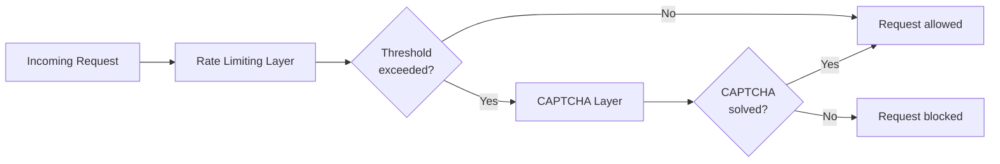

# Rate Limiting Overview

Rate limiting is a technique used to control how many requests a client can make to a service within a given time period. It serves two purposes:

- **Security** - preventing automated abuse such as brute-force attacks, credential stuffing, and scraping.
- **Stability** - protecting the service from being overwhelmed by traffic spikes, whether malicious or legitimate.

When a client exceeds a defined threshold, the service can respond in different ways - returning an error, slowing down responses, or in our case, triggering a CAPTCHA challenge.

## How Rate Limiting Relates to CAPTCHA

Our service does not hard-block requests that exceed rate limits. Instead, it presents a CAPTCHA challenge, allowing legitimate users to continue while stopping automated scripts. Two of the five CAPTCHA trigger rules are directly rate-limit based:

- More than 500 requests from the same IP in 20 minutes. See [Rule 1](../security/captcha-trigger-rules.md#rule-1-ip-request-volume).
- Current hour traffic exceeds double the 2-week average. See [Rule 3](../security/captcha-trigger-rules.md#rule-3-anomalous-traffic-volume).

<em>Figure 1. Rate limiting and CAPTCHA interaction — how the two layers work together.</em>

## Current Thresholds

| Rule | Threshold | Window |
|---|---|---|
| Per-IP request volume | > 500 requests | 20 minutes |
| Service-wide traffic spike | > 2× 2-week hourly average | Current 1-hour bucket |

## Handling Legitimate Traffic Spikes

Rule 3 (service-wide traffic spike) can trigger CAPTCHA challenges for all users during genuine high-traffic events such as product launches or marketing campaigns. If you anticipate a traffic spike:

1. Notify the engineering team in advance so thresholds can be adjusted if needed.
2. Consider pre-enabling a targeted manual CAPTCHA override on sensitive endpoints only, rather than having the blanket spike rule fire unexpectedly. See [Manual CAPTCHA Controls](manual-captcha-controls.md).
3. Monitor the situation via [PLACEHOLDER: Link to traffic monitoring dashboard].

## Frequently Asked Questions

**Do rate limits reset automatically?**  
Yes. Per-IP limits ([Rule 1](../security/captcha-trigger-rules.md#rule-1-ip-request-volume)) reset when the 20-minute window expires. Service-wide spike detection ([Rule 3](../security/captcha-trigger-rules.md#rule-3-anomalous-traffic-volume)) is recalculated each hour bucket.

**Are rate limits applied per endpoint or globally?**  
> [PLACEHOLDER]

**Can different endpoints have different thresholds?**  
> [PLACEHOLDER]

## Related Resources
- [Bot Protection Overview](../security/bot-protection-overview.md)
- [CAPTCHA Trigger Rules](../security/captcha-trigger-rules.md)
- [Manual CAPTCHA Controls](manual-captcha-controls.md)
