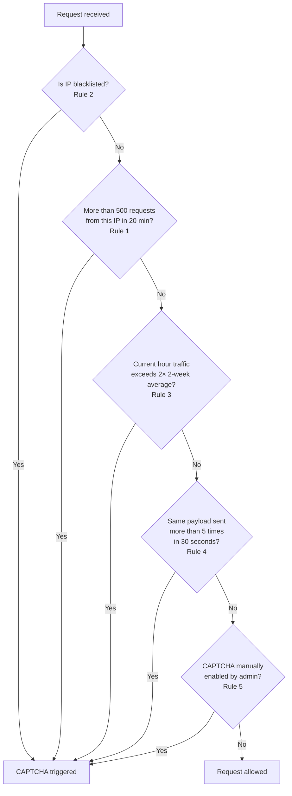

# Bot Protection Overview

Not all traffic to a service comes from real users. A significant portion of requests on any public-facing service are sent by automated programs - commonly called **bots**. Some bots are benign (such as search engine crawlers), but many are malicious.

Common malicious bot behaviors include:

- **Credential stuffing** - using large lists of leaked username/password pairs to attempt logins at high speed.
- **Scraping** - systematically extracting content or data from a service without permission.
- **Denial of service** - flooding a service with requests to degrade performance for legitimate users.
- **Form spam** - submitting fake data through public forms at scale.

## How Our Service Detects Bots

Our service uses a layered approach to bot detection. Rather than relying on a single signal, multiple independent rules are evaluated on each incoming request. This reduces both false positives (blocking real users) and false negatives (missing actual attacks).

The detection layers are:

| Layer | Mechanism | Details |
|---|---|---|
| Volume-based | IP request rate | See [CAPTCHA Trigger Rules - Rule 1](captcha-trigger-rules.md#rule-1-ip-request-volume) |
| Reputation-based | IP blacklist | See [CAPTCHA Trigger Rules - Rule 2](captcha-trigger-rules.md#rule-2-ip-blacklist-match) |
| Anomaly-based | Traffic spike detection | See [CAPTCHA Trigger Rules - Rule 3](captcha-trigger-rules.md#rule-3-anomalous-traffic-volume) |
| Behavior-based | Repeated payload detection | See [CAPTCHA Trigger Rules - Rule 4](captcha-trigger-rules.md#rule-4-repeated-identical-payload) |
| Manual | Admin override | See [CAPTCHA Trigger Rules - Rule 5](captcha-trigger-rules.md#rule-5-manual-admin-override) |

When any layer detects suspicious activity, the service responds with a **CAPTCHA challenge** requiring the user to prove they are human before their request is processed.

## Why CAPTCHA and Not an Outright Block?

Blocking requests outright risks affecting legitimate users, particularly in cases where detection is based on indirect signals (such as traffic spikes or shared IP addresses). Presenting a CAPTCHA instead allows real users to continue with minimal disruption, while stopping automated scripts that cannot solve the challenge.

<em>Figure 1. Bot protection decision flow — all five rules evaluated per request.</em>

## Limitations

No bot detection system is perfect. Known limitations of the current approach include:

- **Shared IPs:** Users behind a corporate proxy or NAT gateway share an IP address. A bot on the same network can cause legitimate users to be challenged.
- **Sophisticated bots:** Some advanced bots can solve standard CAPTCHAs. The current implementation does not address this case.
- **Traffic spikes from legitimate events:** A product launch or marketing campaign can trigger the anomaly detection rule ([Rule 3](../security/captcha-trigger-rules.md#rule-3-anomalous-traffic-volume)), causing real users to see CAPTCHAs. See [Rate Limiting Overview](../admin/rate-limiting-overview.md) for how to handle this proactively.

## Related Resources

- [CAPTCHA Trigger Rules](captcha-trigger-rules.md)
- [IP Blacklist Management](ip-blacklist-management.md)
- [Rate Limiting Overview](../admin/rate-limiting-overview.md)
