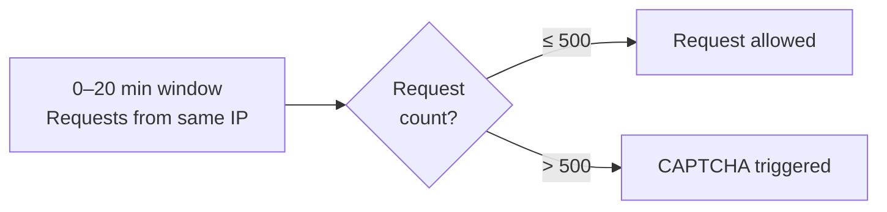
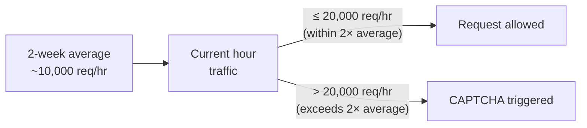

# CAPTCHA Trigger Rules

## Overview

This article describes the conditions under which our service presents a CAPTCHA challenge to users. Understanding these rules helps technical specialists diagnose unexpected CAPTCHA appearances, tune thresholds, and communicate behavior to other stakeholders.

CAPTCHA (**C**ompletely **A**utomated **P**ublic **T**uring test to tell **C**omputers and **H**umans **A**part) is a security mechanism designed to distinguish human users from automated scripts and bots. While CAPTCHA is effective at blocking malicious traffic, it introduces friction in the user journey, so our service applies it selectively, based on the rules described below.

!!! note
    If you are unfamiliar with how CAPTCHAs work in general, see [PLACEHOLDER: Link to "What is CAPTCHA? - Background Reading"] before continuing.

## When Does a CAPTCHA Appear?

A CAPTCHA is shown to the user when **any one** of the following five conditions is met. The rules are evaluated independently - satisfying a single rule is sufficient to trigger a challenge.

### Rule 1 - IP Request Volume

**Trigger:** More than **500 requests** from the same IP address within any **20-minute** window.

This rule protects against high-frequency automated attacks originating from a single source, such as credential stuffing or scraping bots.

| Parameter | Value |
|---|---|
| Request threshold | > 500 |
| Time window | 20 minutes |
| Grouping | Per IP address |

**Example:** A single IP sends 600 login attempts over 15 minutes. On the 501st request, a CAPTCHA challenge is triggered for all subsequent requests from that IP within the window.


<p align="center"><em>Figure 1. IP request volume decision flow within a 20-minute window.</em></p>

### Rule 2 - IP Blacklist Match

**Trigger:** The requesting IP address is found in the **IP blacklist**.

The blacklist is a maintained list of IP addresses known to be associated with malicious activity, open proxies, or previously flagged abuse. Any request originating from a blacklisted IP will immediately trigger a CAPTCHA, regardless of request volume or behavior.

**Key points:**

- Blacklist checks happen on **every request**, not just high-volume ones.
- Being removed from the blacklist immediately lifts this trigger.
- The blacklist is managed via the Admin Panel. See [IP Blacklist Management](ip-blacklist-management.md).

> [PLACEHOLDER: Screenshot - Admin Panel IP Blacklist view]

### Rule 3 - Anomalous Traffic Volume

**Trigger:** The number of requests received in the **current 1-hour bucket** exceeds **more than double** the average hourly request rate over the **past 2 weeks**.

This rule detects sudden, unusual traffic spikes that may indicate a coordinated attack or bot wave - even if no single IP is responsible. It compares real-time load against a rolling historical baseline.

| Parameter | Value |
|---|---|
| Comparison window | Current 1-hour bucket |
| Baseline | Rolling 2-week average (per hour) |
| Threshold | > 2× the baseline average |

**Example:** The average hourly request volume over the past 2 weeks is 10,000 requests. If the current hour reaches 20,001 requests, CAPTCHAs begin triggering for incoming traffic.


<p align="center"><em>Figure 2. Traffic spike detection against the 2-week hourly average.</em></p>

!!! note
    This rule is traffic-wide and is not tied to a specific IP. During a spike event, users who would not otherwise encounter a CAPTCHA may be challenged.

### Rule 4 - Repeated Identical Payload

**Trigger:** The **same payload** is submitted more than **5 times** within **30 seconds**.

This rule targets replay attacks and automated form-submission bots that send identical request bodies in rapid succession - for example, bots attempting the same form submission repeatedly.

| Parameter | Value |
|---|---|
| Repetition threshold | > 5 times |
| Time window | 30 seconds |
| Matching method | Exact payload match |

**Example:** A bot submits the same search query or form body 6 times within 20 seconds. On the 6th submission, a CAPTCHA is shown.

```json
{
  "query": "admin login",
  "filters": {
    "category": "users",
    "limit": 100
  }
}
```

| Submission | Timestamp | Payload match | Action |
|---|---|---|---|
| 1st | 00:00.000 | — | ✅ Allowed |
| 2nd | 00:04.212 | Identical | ✅ Allowed |
| 3rd | 00:08.631 | Identical | ✅ Allowed |
| 4th | 00:13.004 | Identical | ✅ Allowed |
| 5th | 00:17.445 | Identical | ✅ Allowed |
| 6th | 00:21.887 | Identical | ⚠️ CAPTCHA triggered |

### Rule 5 - Manual Admin Override

**Trigger:** A CAPTCHA has been **manually enabled** via the Admin Panel for specific requests or request types.

Administrators can directly force CAPTCHA challenges for targeted traffic through the Admin Panel. This may be used during security incidents, for testing purposes, or to proactively protect specific endpoints. See [Manual CAPTCHA Controls](../admin/manual-captcha-controls.md).

**Common use cases:**

- Temporarily requiring CAPTCHA on a specific endpoint during an active attack.
- Enabling CAPTCHA for QA or integration testing.
- Applying CAPTCHA to a specific user segment or request type as a precautionary measure.

> [PLACEHOLDER: Screenshot - Admin Panel manual CAPTCHA toggle with callouts]

## Summary Table

| Rule | Condition | Key Parameters |
|---|---|---|
| 1 - IP Volume | >500 requests from same IP | 20-minute window |
| 2 - IP Blacklist | IP is on the blacklist | Checked on every request |
| 3 - Traffic Spike | Current hour > 2× 2-week avg | Hourly bucket, 2-week baseline |
| 4 - Repeated Payload | Same payload sent >5 times | 30-second window |
| 5 - Manual Override | Admin-enabled via panel | Configurable per request/endpoint |

!!! warning
    Rules are evaluated **independently**. Any single rule being satisfied is sufficient to trigger a CAPTCHA.

## How CAPTCHA Is Presented to the User

When a trigger condition is met, the user receives a CAPTCHA challenge inline with their current interaction.

> [PLACEHOLDER: Screenshot - Example of CAPTCHA challenge as presented to end users]

> [PLACEHOLDER: Request/response example - HTTP response headers or body returned when CAPTCHA is triggered, e.g., a 4xx response with challenge token or redirect URL.]

Upon successful completion of the CAPTCHA, the user's request is processed normally. Failed or abandoned CAPTCHA attempts result in the request being blocked.

!!! note "For Support & Ops Specialists"
    - If a user reports an unexpected CAPTCHA, check whether their IP appears in the blacklist first (Rule 2), then review whether a traffic spike event was active at the time (Rule 3).
    - Rule 1 and Rule 4 are behavioral - they reset when the respective time window expires.
    - Manual overrides (Rule 5) persist until explicitly removed by an admin.

## Limitations
- [Rule 3](../security/captcha-trigger-rules.md#rule-3-anomalous-traffic-volume) (traffic spike) can cause legitimate users to encounter CAPTCHAs during unexpected but genuine traffic surges (e.g., a product launch or viral event).
- IP-based rules ([Rule 1](../security/captcha-trigger-rules.md#rule-1-ip-request-volume), [Rule 2](../security/captcha-trigger-rules.md#rule-2-ip-blacklist-match)) may affect multiple users sharing a NAT gateway or corporate proxy.

## Related Resources

- [Bot Protection Overview](bot-protection-overview.md)
- [IP Blacklist Management](ip-blacklist-management.md)
- [Manual CAPTCHA Controls](../admin/manual-captcha-controls.md)
- [Rate Limiting Overview](../admin/rate-limiting-overview.md)
